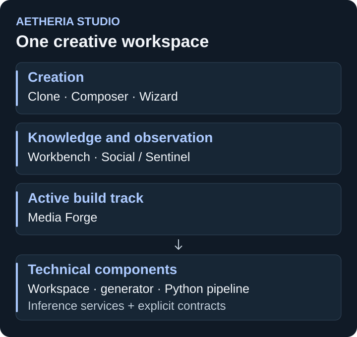

# Aetheria Studio

**Aetheria · Studio · Website creation and creative workflows**

Aetheria Studio is an AI-assisted workspace for creating and refining websites. Clone, Composer and Wizard share reusable template contracts; Workbench provides the knowledge and evaluation workspace. Social / Sentinel adds source observation and evidence review within the same Studio environment.

[Portfolio](../README.md) · [Music: Master / RACK](master-rack.md)

*Product and component map, not an application screenshot.*

## Workflows and status

| Workflow | What it provides | Documented status |
| --- | --- | --- |
| **Clone** | Reference capture and an editable website starting point | Implemented |
| **Composer** | Section assembly, styles, motion, multi-page composition and refinement | Implemented |
| **Wizard** | Structured brief to generated page using the shared template contract | Implemented, v1 |
| **Workbench** | Enrichment controls, source management, corpus visibility and evaluation workflows | Implemented core; training remains research |
| **Social / Sentinel** | Channel continuity, feed observation, activity and evidence-review views | Implemented local workflows; live access and claim coverage vary by source |
| **Media Forge** | Media scanning, generation, guarding and integration workers | In development; complete routing remains open |

## One product, explicit components

The **Next.js workspace** owns navigation, user interaction and orchestration. The **generator** handles website generation. The **Python pipeline** handles extraction, knowledge, evaluation and supporting workflows. Inference services are integrated through explicit service boundaries.

These technical repositories form one Studio product. Health-aware interfaces show unavailable services and reviewable outputs rather than hiding failures.

## Recent engineering evidence

The **6 September 2026 Studio record** reports 371 specification files and 4,255 tests passing, clean lint / type checks and a successful production build.

The **4 October 2026 local Social / Sentinel rollout record** reports clean lint / type checks, **4,576 tests passing and one skipped**, a successful production build, and responsive fixture / deployed-browser checks. This later evidence concerns local development; it does not establish that every change is included in the GitHub source snapshot.

Recent work preserves channel-switch state and observers, distinguishes failed extraction from verification results, and makes saved-data access explicit. Synthetic fixture checks are distinguished from real platform acquisition. A pending retry or configured connection is not proof of usable claim evidence.

## Development boundaries

Media Forge's complete workflow, broader live-source access, forecast eligibility and generalizing model training remain gated work. A richer retrieval / knowledge store is not proof that production model weights have been trained. Wizard's knowledge-store grounding remains a separate development direction.

Reference sites and media require appropriate rights. Private corpora, account sessions and creative material are excluded from this portfolio.
