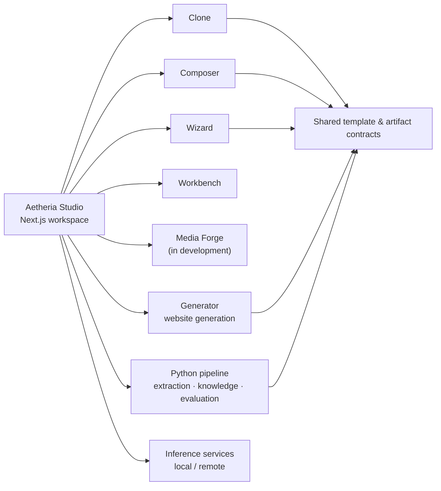

# Aetheria Studio

**Product family:** Aetheria · **Domain:** Studio · **Role:** flagship creative system

**A modular AI-assisted website-creation workspace that brings reference cloning, composition, brief-driven generation and design-learning workflows into one product.**

[Back to the portfolio](../README.md)

## At a glance

Aetheria Studio is designed as one self-contained product rather than a collection of disconnected demos. The Studio workspace coordinates specialized components for website generation, extraction/knowledge processing and inference while keeping their responsibilities explicit.

The current repository documentation describes four substantial user-facing workflows and one active build track:

| Workflow | Purpose | Documented status |
| --- | --- | --- |
| **Clone** | Turn a reference into an editable website starting point | Built |
| **Composer** | Combine and refine sections, styling, motion and multi-page compositions | Built |
| **Wizard** | Turn a structured brief into a generated page | Built, v1 |
| **Workbench** | Operate enrichment and training/evaluation workflows | Built, phase 1 |
| **Media Forge** | Scan, generate, guard and integrate media assets | In development |

These statuses summarize the private project documentation; they are not a fresh production certification.

## How the system is shaped

The product is implemented across three private technical repositories:

- **Studio workspace** — navigation, product UI, orchestration and health-aware service boundaries.
- **Generator** — the website-generation engine.
- **Pipeline** — extraction, knowledge, evaluation and supporting Python workflows.

Those repositories are components of **Aetheria Studio**, not separate portfolio products.

## Creation workflows

### Clone

Clone turns a reference into an editable starting point. The documented implementation includes extraction, an editable template contract and safeguards around generated output. A reference is an input to a workflow, not permission to republish somebody else's protected assets.

### Composer

Composer is the assembly and refinement workspace. The documented implementation supports section selection and reordering, site styles, motion choices, multi-page compositions, live patching, refinement and asset rehosting.

The goal is to make composition inspectable: structure, styling and generated changes remain editable instead of being hidden behind a single opaque generation step.

### Wizard

Wizard starts with a structured brief and compiles it into a generation request. The documented v1 uses a multi-step intake and shares the same template contract as the other creation paths.

Knowledge-store grounding remains a separate development direction rather than something this portfolio page claims as complete.

### Workbench

Workbench is the operational side of the design-knowledge loop. The private documentation describes controls for enrichment readiness, source management, run history, corpus visibility and evaluation/training experimentation.

The important boundary is that **retrieval and an improving knowledge store are not the same as training new production model weights**.

### Media Forge

Media Forge is the active build track for media scanning, generation, guarding and integration. Workers and a Studio panel are documented, but the complete end-to-end route is not yet presented here as finished.

## Engineering principles

Aetheria Studio is being developed around a few recurring constraints:

- **Explicit component boundaries.** Workspace, generator, pipeline and inference services have distinct responsibilities.
- **Shared contracts.** Creation modes exchange reusable template/artifact structures instead of inventing incompatible outputs.
- **Inspectable automation.** Generated or proposed changes should remain reviewable and editable.
- **Health-aware integration.** Unavailable services should be visible as unavailable rather than silently presented as successful.
- **Rights-aware inputs.** References, screenshots, media and generated assets still require appropriate rights and permissions.
- **Evidence before capability claims.** Research tracks and incomplete integrations stay labeled as such.

## Dated engineering evidence

The Aetheria Studio repository records the following verification snapshot for **6 September 2026**:

- 371 specification files / 4,255 tests reported green;
- ESLint reported clean;
- TypeScript `tsc --noEmit` reported clean;
- the Next.js production build reported successful.

I did not rerun those checks as part of this public-portfolio update, so the date is preserved rather than presented as a live status badge.

## What this page does not claim

Aetheria Studio is an active development system, not a claim of universal production readiness.

In particular:

- Media Forge remains in development.
- No fine-tuned model is presented here as production-proven.
- Workbench research does not imply that a trained adapter has passed a generalization gate.
- A knowledge store becoming richer is not equivalent to model-weight training.
- This portfolio update does not establish a fresh end-to-end runtime, deployment or security certification.

Private source code, credentials, local corpora and creative material are intentionally excluded from the public portfolio.

## Aetheria family

**Aetheria Studio** covers website creation, UI/UX, effects and creative-tool enrichment.

**Aetheria Music** is a sibling domain. Its first documented product is **[Master / RACK](master-rack.md)**, a modular audio-mastering project. Aetheria Music is not an internal module of Aetheria Studio.
