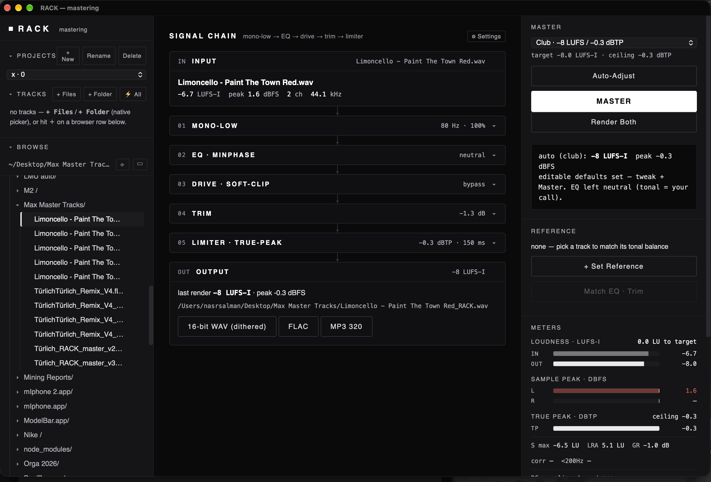

# Master / RACK

**Aetheria · Music · Electronic-music mastering**

Master / RACK is a modular mastering project for techno and electronic music. It makes the processing chain, loudness targets and output decisions visible and editable.

[Portfolio](../README.md) · [Website creation: Aetheria Studio](aetheria-studio.md)

*Application capture supplied on 2 October 2026. Displayed session measurements are not an independent audio-quality evaluation.*

## What exists

- An editable **mono-low → EQ → drive → trim → limiter** chain.
- Club / streaming targets and input / output loudness meters.
- A C++ DSP core, Web Audio / WebAssembly path and Tauri desktop shell.
- Export controls with WAV, FLAC and MP3 options visible in the captured workspace.

The captured session uses a club target of −8 LUFS / −0.3 dBTP. It shows how the controls and measurements fit together; no copyrighted audio is distributed here.

## Engineering focus

Real-time audio processing must stay predictable. The project excludes blocking work from the processing path and compares browser / native behavior within defined numerical tolerances. Optional AI assistance belongs on a separate execution boundary.

The **7 September 2026 maintenance record** documents a repair for child-process output handling, with Rust checks and four tests passing, plus an application rebuild. That receipt supports the specific repair, not a blanket audio-quality or platform-compatibility claim.

## Development status

The implemented direction is manual DSP. An AI co-pilot remains a deferred, optional layer. Release readiness and comparative listening quality require their own evaluation.

Master / RACK is the Music project within Aetheria. It has its own audio-processing system, separate from Studio's website-creation components.
