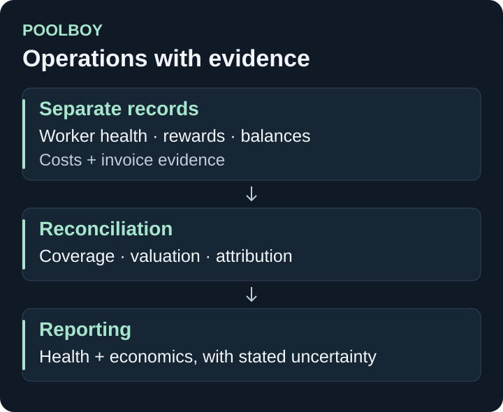

# PoolBoy

**Matheria · Finance · Mining operations**

PoolBoy is a Bitcoin-mining monitoring and economics dashboard. It connects operational visibility with reporting that distinguishes credited earnings, received payouts, estimated costs and invoice evidence.

[Portfolio](../README.md) · [Trading research: 2DEXY Full-Stack](2dexy-fullstack.md)

*Reporting architecture, not a dashboard screenshot.*

## What exists

- Pool and worker-health collection with separate reward, balance and availability records.
- Economics views with cost profiles, valuation and reconciliation.
- Profitability ledgers that expose complete, partial, estimated and withheld inputs.
- Invoice-review workflows, evidence snapshots and reporting tools.
- Operational guidance and an assistant grounded in the dashboard's available evidence.

Missing coverage remains visible. A pool credit, a wallet receipt and a verified hosting cost each answer a different question; the reporting system keeps those distinctions intact.

## Engineering and evidence

**Stack:** Next.js, React, TypeScript and PostgreSQL, with collection and reporting tooling.

The **2 October 2026 source-publication record** reports a passing typecheck and **3,162 tests passing**. Five listener-dependent tests failed or timed out; the record identifies sandbox listener errors among those failures. Database integration tests, a production build and live runtime checks were outside that publication run.

The public overview contains no account identifiers, balances, invoices or operational records.

## Development status

Monitoring and evidence-aware reporting are implemented and under active refinement. Accounting completeness depends on source coverage and supplied cost evidence. Estimates are labelled; report totals are not presented as independent proof of hashing, payout receipt or investment performance.
