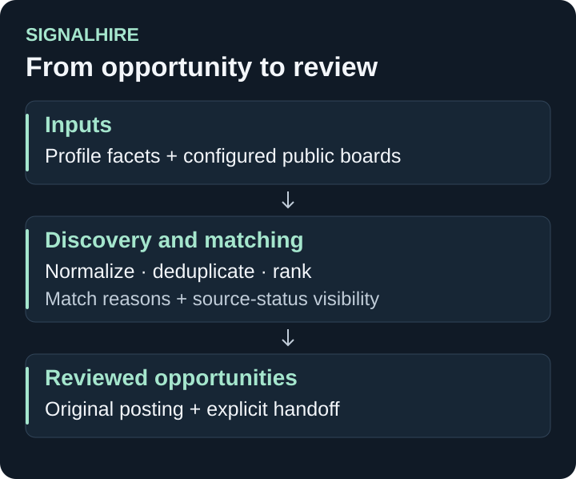

# SignalHire

**Matheria · Office · Opportunity discovery**

SignalHire is a local healthcare and biotech job-discovery workspace. It brings profile setup, configured public job sources, explainable matching and an explicit application handoff into one search flow.

[Portfolio](../README.md) · [Application creation: ApplyFi](applyfi.md)

*Implementation map, not an application screenshot.*

## What exists

- A **Find jobs** workspace with profile editing, CV import and match explanations.
- Configured Greenhouse and Lever adapters, bounded ingestion and deduplication.
- Deterministic ranking, original-posting links and local job persistence.
- Search caching, explicit refresh and visible source-failure / stale-result states.
- An explicit application handoff and structured CV-creator profile/event contracts.

LinkedIn support opens a search link in the user's browser. The separate market-insight workspaces use labelled offline examples.

## Engineering and evidence

**Stack:** Python, FastAPI, SQLite / FTS5 and a browser workspace.

The **30 September 2026 quality record** reports **64 tests passing**, successful compile and dependency checks, and browser verification of search, profile controls, source failures, keyboard navigation and responsive layouts. It records point-in-time public-board retrieval; future availability depends on the configured sources.

CV content is digested into structured facets. The documented release keeps raw CV text out of durable integration storage and does not send profiles to an AI provider.

## Development status

Discovery and matching are implemented. Source expansion, production insight feeds, ML ranking and durable application lifecycle / receipt upgrades remain future work. The existing handoff does not establish an end-to-end ApplyFi integration or automatic application submission.
